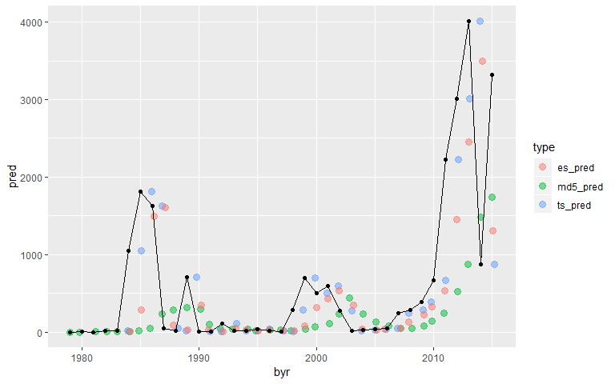
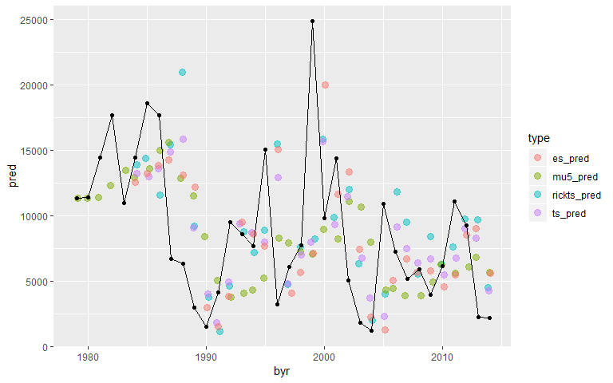
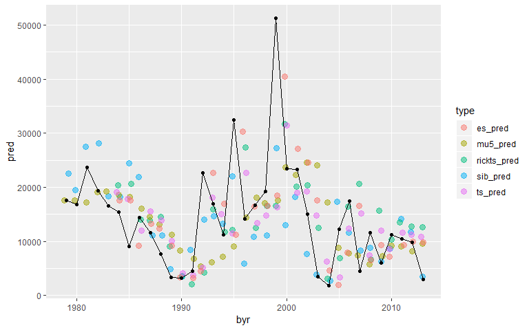
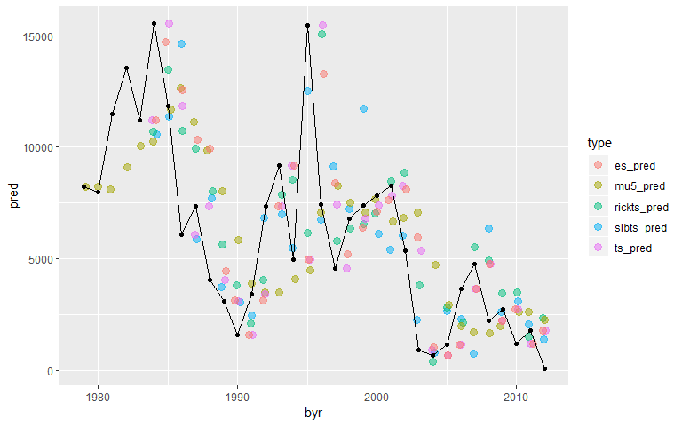

## Introduction
Since we are working with lognormal data we conduct the analysis on the log scale and then transform back to the natural scale. Last year, we always transformed back to the mean. Throughout this document we are transforming back to the median. Theoretically, this change should do a better job at minimizing absolute errors (I verified this in the age specific codes).
  
## Age 3
We do have modeled abundance of age 3 fish and we might as well use those given we use them everywhere else. We can go through the same process for the age 3 fish but I think the 5 year moving average is the right choice here. The data is too sparse to have much confidence in the other methods and it has been 5 years of large age 3 run sizes.


```r
comp_models(dat3, 3)
```

```
## [[1]]
```

<!-- -->

```
## 
## [[2]]
## # A tibble: 3 x 3
##   type         md   mad
##   <chr>     <dbl> <dbl>
## 1 es_pred   -837. 1884.
## 2 md5_pred -1715. 1957.
## 3 ts_pred   -529. 1783.
```
  
Here is the prediction. First, we find the rows of our dataset that have the last 5 years of age 3 run sizes then we calculate the prediction referencing those row numbers.

```r
tail(dat3)
```

```
##     byr     S age3      lnRS       ln  md5_pred ts_pred   es_pred
## 32 2010 16661  672 -3.210568 6.510258  136.4407     391  328.9577
## 33 2011 19978 2223 -2.195774 7.706613  244.9950     672  537.9201
## 34 2012 12459 3012 -1.419839 8.010360  527.5904    2223 1456.2817
## 35 2013 19532 4009 -1.583512 8.296297  872.8640    3012 2453.0219
## 36 2014 15083  874 -2.848243 6.773080 1478.0030    4009 3492.2334
## 37 2015 25490 3316 -2.039527 8.106515 1735.9701     874 1311.7984
```

```r
exp(mean(dat3$ln[33:37]))
```

```
## [1] 2388.863
```
  
## Age 4

There is no sibling relationship for this age class and all of the models have struggled recently. The best preforming models seem to be the Ricker model and the univariate time series model. I prefer the univariate model because the Ricker model is really dependent on it's time series component.

```r
comp_models(dat4, 4)
```

```
## [[1]]
```

<!-- -->

```
## 
## [[2]]
## # A tibble: 4 x 3
##   type            md   mad
##   <chr>        <dbl> <dbl>
## 1 es_pred       455. 3637.
## 2 mu5_pred     -113. 3364.
## 3 rickts_pred  1369. 2768.
## 4 ts_pred       584. 2678.
```
  
To get a prediction for the univariate model you can use the predict function.

```r
exp(predict(ts4, n.ahead = 1)$pred)
```

```
## Time Series:
## Start = 37 
## End = 37 
## Frequency = 1 
## [1] 3894.312
```
  
Note that the Ricker model prediction is similar. Looking at the brood table first I use the escapement from 2015 because that is the next brood to produce a 4 year old age class.

```r
tail(deshka)
```

```
##     byr     S age3 age4 age5 age6
## 35 2013 19532 4009 2245 3024   NA
## 36 2014 15083  874 2146   NA   NA
## 37 2015 25490 3316   NA   NA   NA
## 38 2016 22793   NA   NA   NA   NA
## 39 2017 12699   NA   NA   NA   NA
## 40 2018  8549   NA   NA   NA   NA
```

```r
exp(predict(rick4_ts, n.ahead = 1, newxreg = 25490)[[1]]) * 25490
```

```
## Time Series:
## Start = 37 
## End = 37 
## Frequency = 1 
## [1] 3913.12
```
  
## Age 5

The sibling model is clearly the best choice for age-5 fish. 

```r
comp_models(dat5, 5)
```

```
## [[1]]
```

<!-- -->

```
## 
## [[2]]
## # A tibble: 5 x 3
##   type           md   mad
##   <chr>       <dbl> <dbl>
## 1 es_pred     1029. 3089.
## 2 mu5_pred     589. 2553.
## 3 rickts_pred 4872. 5215.
## 4 sib_pred     768. 1768.
## 5 ts_pred     2752. 3810.
```
  
To get the prediction I check the brood table to find the sibling returns for the next 5 year old age class.

```r
tail(deshka)
```

```
##     byr     S age3 age4 age5 age6
## 35 2013 19532 4009 2245 3024   NA
## 36 2014 15083  874 2146   NA   NA
## 37 2015 25490 3316   NA   NA   NA
## 38 2016 22793   NA   NA   NA   NA
## 39 2017 12699   NA   NA   NA   NA
## 40 2018  8549   NA   NA   NA   NA
```

```r
pred_19 <- predict(sib5, newdata = data.frame(age4_ln = log(2146), age3_ln = log(874)), se.fit = TRUE)
exp(pred_19$fit)
```

```
##        1 
## 3524.236
```
  
## Age 6
I don’t see a great model for this age class either. The 5-year moving average is the MAD choice but the figure does not inspire much confidence. We have to build the prediction by hand.

```
## [[1]]
```

<!-- -->

```
## 
## [[2]]
## # A tibble: 5 x 3
##   type           md   mad
##   <chr>       <dbl> <dbl>
## 1 es_pred      936. 1391.
## 2 mu5_pred     623. 1167.
## 3 rickts_pred 1535. 1641.
## 4 sibts_pred  1487. 1539.
## 5 ts_pred      936. 1391.
```
  

```r
tail(dat6[, 1:9])
```

```
##     byr     S  age4  age5 age6      lnRS  age4_ln  age5_ln  age6_ln
## 29 2007 18675  5192  4520 4779 -1.362954 8.554874 8.416267 8.471987
## 30 2008  7615  5866 11614 2239 -1.224091 8.676928 9.359967 7.713785
## 31 2009 12720  3958  6056 2758 -1.528670 8.283494 8.708805 7.922261
## 32 2010 16661  6166 11260 1175 -2.651803 8.726806 9.329012 7.069023
## 33 2011 19978 11083 10450 1793 -2.410741 9.313168 9.254357 7.491645
## 34 2012 12459  9252  9789   97 -4.855488 9.132595 9.189015 4.574711
```

```r
exp(mean(dat6$age6_ln[30:34]))
```

```
## [1] 1047.629
```
  
The next choice would be the exponential smoothing model but the prediction is pretty pessimistic.

```r
exp(forecast::forecast(ets6, h = 1)[["mean"]])
```

```
## Time Series:
## Start = 35 
## End = 35 
## Frequency = 1 
## [1] 127.1077
```
